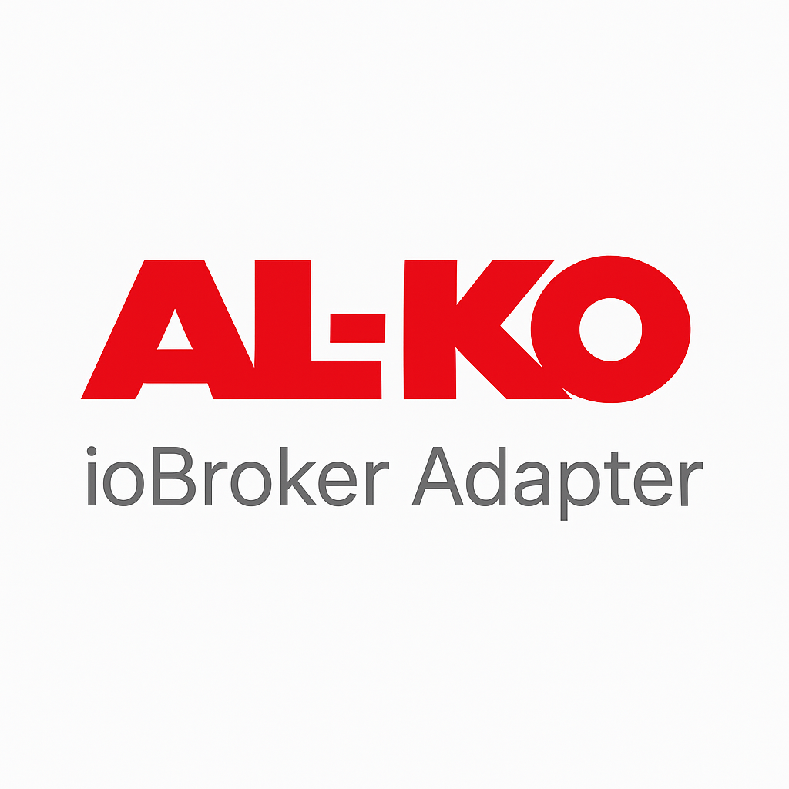

# ioBroker.al-ko

**Tests:** 

---

## ioBroker.al-ko

Adapter zur Kommunikation mit **AL-KO Robolinho** und weiteren AL-KO Gartengeräten.

Adapter for communication with **AL-KO Robolinho** and other AL-KO garden tools.

---

## Funktionsumfang / Features

- Verbindung mit der offiziellen **AL-KO Cloud API**
- Automatisches Anlegen aller relevanten States
- Alle schreibbaren States werden berücksichtigt (Whitelist)
- Änderungen an States werden per API zurück in die Cloud gepusht
- Gerätestatus wird automatisch und in Echtzeit über **WebSocket** aktualisiert
- Authentifizierung via Benutzername / Passwort und API-Client-Daten

---

## Konfiguration

Um den Adapter zu nutzen, benötigen Sie API-Zugangsdaten von AL-KO.  
Diese können Sie hier beantragen:  
👉 [AL-KO IoT API Zugang](https://alko-garden.at/iot-api-zugang-anfordern/)

Im Admin müssen folgende Daten hinterlegt werden:
- **Username** (AL-KO Konto)
- **Password**
- **Client ID**
- **Client Secret**

---

## DISCLAIMER

Dieser Adapter steht **in keinem Zusammenhang mit der Firma AL-KO**.  
Es handelt sich um ein Community-Projekt, und AL-KO bietet **keinen Support** dafür an.

---

## Changelog

### 0.2.0 (2025-10-08)
- 🧹 **Migration auf ESLint 9 (Flat-Config)**
  - Alte `.eslintrc`-Dateien entfernt und durch `eslint.config.mjs` ersetzt  
  - `package.json` angepasst (neue Dev-Dependencies: `@eslint/js`, `typescript-eslint`, `@iobroker/eslint-config`, `prettier`)  
  - Lint-Scope auf `main.js` und `lib/` beschränkt  
  - Alle bisherigen Lint-Fehler und Warnungen behoben  
- 💡 Vorbereitung auf zukünftige „Produktiv-Lint“-Variante für Releases

### 0.1.2 (2025-09-30)
* Verbesserte Admin-UI-Konfiguration 
* Fehler bei der Adapterprüfung behoben

### 0.1.1 (2025-09-29)
* ✨ Initial release
* Verbindung mit der AL-KO API
* Automatisches Anlegen der States
* Push von Änderungen an AL-KO
* WebSocket-Integration für Echtzeit-Updates

---

## License
MIT License

Copyright (c) 2025 Hubert <hubertiob@posteo.at>

Permission is hereby granted, free of charge, to any person obtaining a copy
of this software and associated documentation files (the "Software"), to deal
in the Software without restriction, including without limitation the rights
to use, copy, modify, merge, publish, distribute, sublicense, and/or sell
copies of the Software, and to permit persons to whom the Software is
furnished to do so, subject to the following conditions:

The above copyright notice and this permission notice shall be included in all
copies or substantial portions of the Software.

THE SOFTWARE IS PROVIDED "AS IS", WITHOUT WARRANTY OF ANY KIND, EXPRESS OR
IMPLIED, INCLUDING BUT NOT LIMITED TO THE WARRANTIES OF MERCHANTABILITY,
FITNESS FOR A PARTICULAR PURPOSE AND NONINFRINGEMENT. IN NO EVENT SHALL THE
AUTHORS OR COPYRIGHT HOLDERS BE LIABLE FOR ANY CLAIM, DAMAGES OR OTHER
LIABILITY, WHETHER IN AN ACTION OF CONTRACT, TORT OR OTHERWISE, ARISING FROM,
OUT OF OR IN CONNECTION WITH THE SOFTWARE OR THE USE OR OTHER DEALINGS IN THE
SOFTWARE.
