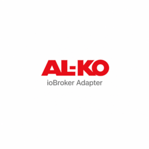

# ioBroker.al-ko

## Overview

The ioBroker.al-ko adapter integrates **AL-KO Robolinho robotic lawnmowers** and other AL-KO smart garden devices into ioBroker using the official **AL-KO Cloud API**, including real-time updates via WebSocket.

This adapter is a **community project** and is **not affiliated with or supported by AL-KO**.

---

## Features

- Connects to the official AL-KO Cloud API
- Automatically creates all readable states
- Writable states controlled through a whitelist
- Sends state changes back to AL-KO (`desired` state API)
- Real-time updates via WebSocket
- Supports multiple devices
- Works with the newest ioBroker admin/jsonConfig format

---

## Requirements

You need AL-KO API credentials, which can be requested here:

➡ https://alko-garden.at/iot-api-zugang-anfordern/

Adapter settings in Admin:

- Username (AL-KO account)
- Password
- Client ID
- Client Secret

---

## Disclaimer

This adapter is **not** affiliated with or supported by AL-KO.  
Do **not** contact AL-KO customer service regarding this project.

---

## Changelog

### 0.3.2 (2026-03-12)

- Improved WebSocket reconnect handling after token refresh
- Prevented reconnect loops on intentional WebSocket closes
- Improved API error logging for push requests
- Added WebSocket close code and reason logging

### 0.3.1 (2026-03-09)

- Documentation improvements
- Corrected LICENSE information
- Updated development dependencies
- Minor CI / workflow cleanup
- No functional changes

### 0.3.0 (2026-03-09)

- Major maintenance release
- Updated ESLint 9, Prettier 3 and TypeScript tooling
- Updated development dependencies
- Improved CI pipeline and adapter structure
- No functional changes

➡ Full changelog here:  
[CHANGELOG.md](./CHANGELOG.md)

---

## License

MIT License

Copyright (c) 2026 Hubert Zechner <hubertiob@posteo.at>

This project is released under the **MIT License**.  
See the included **LICENSE** file for full details.
