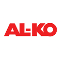

# ioBroker.al-ko – English Documentation

## Overview

The ioBroker.al-ko adapter integrates **AL-KO Robolinho robotic mowers** and other AL-KO smart garden devices into ioBroker.  
It communicates with the official **AL-KO Cloud API**, including real-time updates via WebSockets.

---

## Features

- Connection to the official AL-KO Cloud API
- Automatic creation of all readable states
- Writable states controlled through a whitelist
- Changes to writable states are propagated back to AL-KO via the `desired` API
- Real-time updates through WebSocket
- Supports multiple devices
- Fully compatible with modern ioBroker admin/jsonConfig

---

## Requirements

To use this adapter, AL-KO API credentials are required.

Request access at:  
➡ https://alko-garden.at/iot-api-zugang-anfordern/

Required fields:
- Username  
- Password  
- Client ID  
- Client Secret  

Enter these values in Admin → Instance Settings.

---

## Disclaimer

This adapter is **not** affiliated with or supported by AL-KO.  
It is a **community-developed project**.

---

## Changes (Summary)

### **0.3.0**
See full changelog here:  
➡ [CHANGELOG.md](../../CHANGELOG.md)

Key updates:
- Internal cleanup and consistency improvements  
- Improved logging, ID sanitizing and timers  
- Documentation restructured  

---

## License

Released under the **MIT License**.
